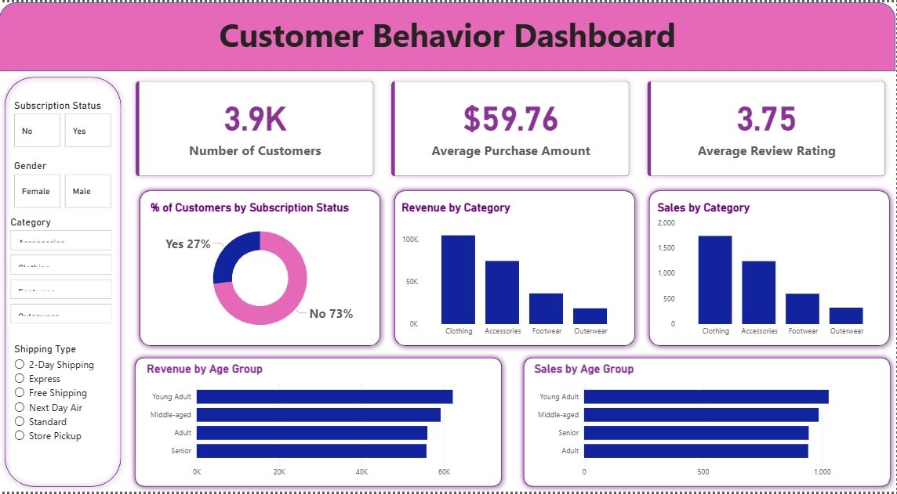

# 📊 Customer Shopping Behavior – End-to-End Data Analytics Project

## 🔍 Project Overview
This project demonstrates a **real-world, corporate-style data analytics workflow**, showcasing how raw transactional data can be transformed into **actionable business insights**.

It reflects the complete journey of a **Data Analyst** — from data cleaning and exploration to **stakeholder-ready dashboards and reports**.

The goal of this project is to simulate how analytics teams operate in organizations by integrating **Python, SQL, and Power BI** into one cohesive, end-to-end analytics pipeline.

---

## 🎯 Project Objectives
- Convert raw customer shopping data into **structured, analysis-ready datasets**
- Identify **meaningful patterns** in customer behavior and purchasing trends
- Answer **business-driven questions** using SQL
- Communicate insights effectively through **dashboards, reports, and presentations**

---

## 🛠️ Tools & Technologies
- **Python** – Data preparation, cleaning, modeling, and exploratory analysis  
- **SQL (MySQL / PostgreSQL / MS SQL Server)** – Business analysis and querying  
- **Power BI** – Interactive dashboards and visual storytelling  
- **Jupyter Notebook** – Analysis and database integration  
- **Gamma AI** – Presentation and storytelling design  

---

## 📁 Project Structure

### 1️⃣ Data Preparation & Exploration (Python)
📓 **Customer_Shopping_Behavior_Analysis.ipynb**

This notebook includes:
- Data import and initial inspection  
- Exploratory Data Analysis (EDA)  
- Data cleaning and transformation  
- Feature understanding and validation  
- Database connection setup  
- Loading cleaned data into an SQL database  

---

### 2️⃣ Database Creation & Data Loading (SQL + Python)
- Creation of a relational database  
- Loading processed data from Python into SQL  
- Validation of successful data insertion  

**Supported Databases:**
- MySQL  
- PostgreSQL  
- MS SQL Server  

---

### 3️⃣ Business Analysis Using SQL
📄 **customer_behavior_sql_queries.sql**

This file answers key business questions such as:
- Revenue distribution across customer segments  
- Gender-based and category-based spending patterns  
- Customer loyalty and repeat purchase behavior  
- Purchase drivers and sales performance indicators  

Each query is written with **clear comments** to reflect business intent and analytical reasoning.

---

## 📊 Data Visualization & Dashboarding (Power BI)
📊 **customer_behavior_dashboard.pbix**

Below is the interactive Power BI dashboard designed to analyze customer behavior, revenue trends, and segmentation insights.

**Key Dashboard Insights:**
- Non-subscribers form the majority of customers (~73%)
- Clothing category generates the highest revenue and sales
- Young Adults contribute the most to overall revenue
- Subscription status significantly impacts spending behavior

Designed to support **data-driven decision-making** for stakeholders.

---

### 5️⃣ Reporting & Presentation
📑 **Project Report**
- Executive summary of findings  
- Key insights backed by data  
- Business recommendations  
- Analytical conclusions  

🎤 **Presentation Deck**
- Visually communicates insights  
- Highlights trends and strategic recommendations  
- Built using **Gamma AI** for professional storytelling  

---

## 📈 Key Skills Demonstrated
- End-to-end data analytics workflow  
- Business-focused SQL querying  
- Data modeling and cleaning using Python  
- Dashboard design and insight communication  
- Analytical thinking and storytelling  

---

## 🚀 Outcome
This project reflects how a **Data Analyst operates in a real organization**, working across tools and teams to transform raw data into **meaningful business value**.

---

## 📌 Author
**Shabeer Ahamed**  
Data Analyst Aspirant | Python | SQL | Power BI | Excel
